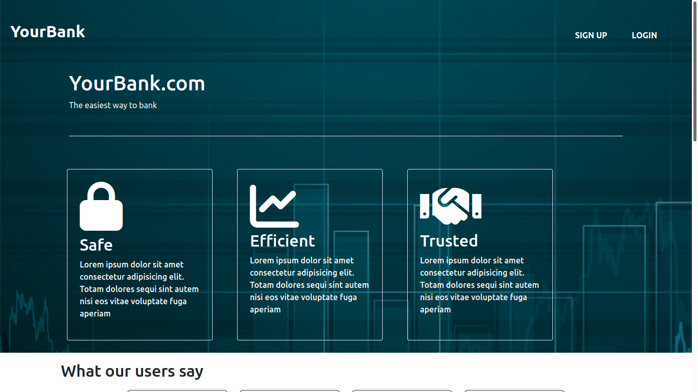

# Banking application

***
## Table of contents
- [live demo](#live-demo)
- [description](#description)
- [version](#version)
- [usage](#usage)
***

## Live demo
> [Click here](https://) for live demo
> 

## Description
A banking application written in asp.net\
It enables users to make transactions like wire transfers, cash deposits and overdrafts\
Users are also able to view transaction history\
There are three types of users:
1. Customers
- Can make wire transfers on their own.
- They need a cashier to do cash deposits and withdrawals for them.
- Can only view transactions related to their account

2. Cashiers
- Perform cash deposits
- Perform wire transfers
- Perform cash withdrawals
- Can view all transactions for all accounts

3. Admins
- Creation of cashiers
- Creation of other admins
- Adjusting cashier limits
- Approval of pending transactions
- Can view all transactions for all accounts

Once a new cashier or admin is created, the owner of the created account will\
need to reset their password using the **_forgot password_** option on the login page.\
The new user will then be able to access their account using their username and newly created password\
**Already set up user accounts can be found in [auth.txt](auth.txt) in the project root**

## Version
1.2

## Usage
Clone the repository
##### visual studio
- Open the project using visual studio.
- select **debug** from the toolbar, then **start without debugging**. Alternatively, press `ctrl + f5`

##### visual studio code
- make sure the dotnet cli is installed. Installation instructions can be found [here](https://docs.microsoft.com/en-us/dotnet/core/install/)
- Change directory to the project root, where the project sln file is located
- Change directory again to **MvcBankingApplication** directory
- Open up the integrated terminal. The keyboard shortcut is `ctrl + backtick` for linux and windows and `cmd + backtick` for mac. Alternatively, you can select `view` from the toolbar, then `terminal`.
- Run `dotnet run` from the terminal. Alternatively, you can press `f5` to run the application in debug mode.

